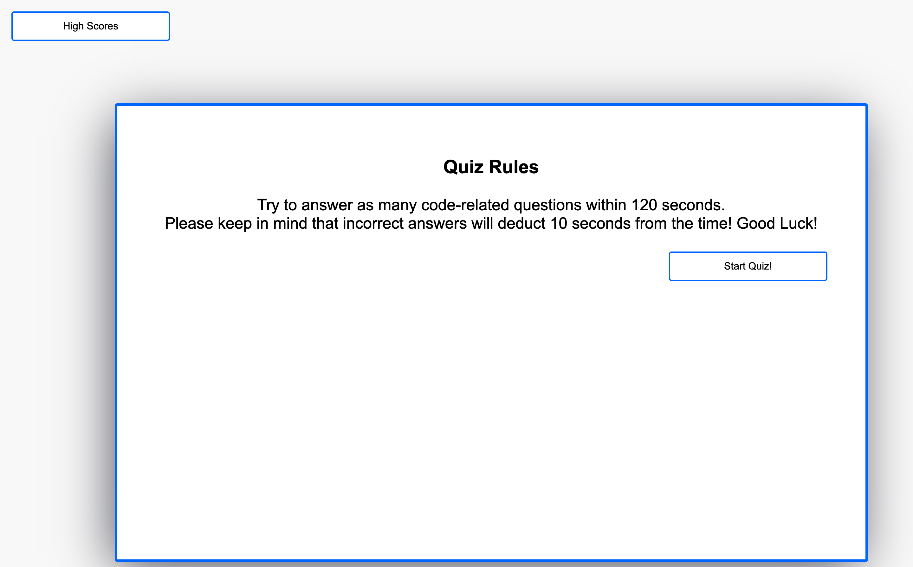
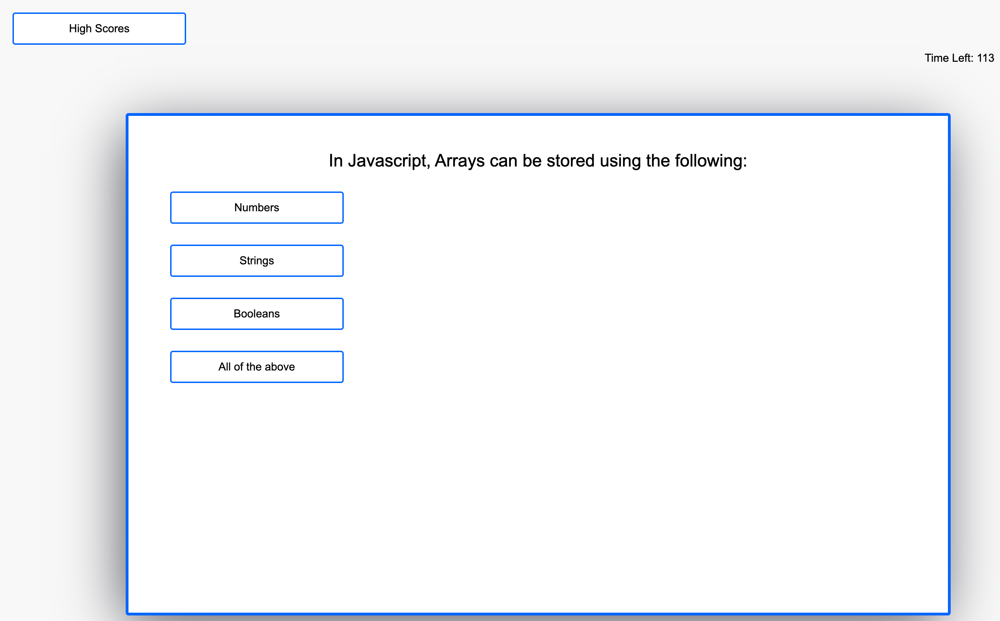
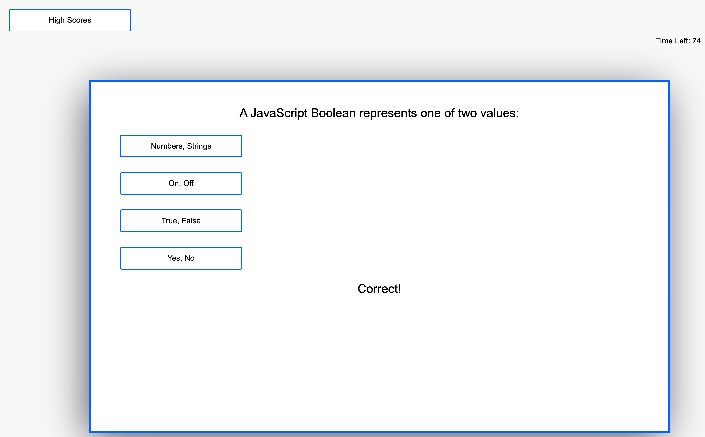
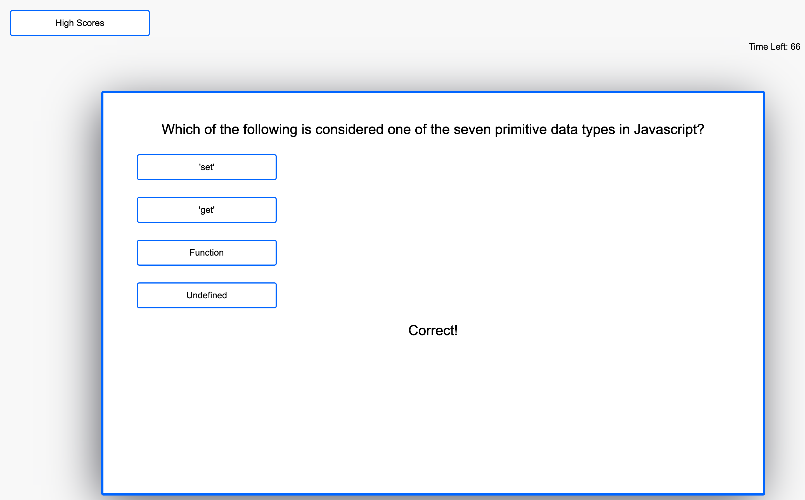
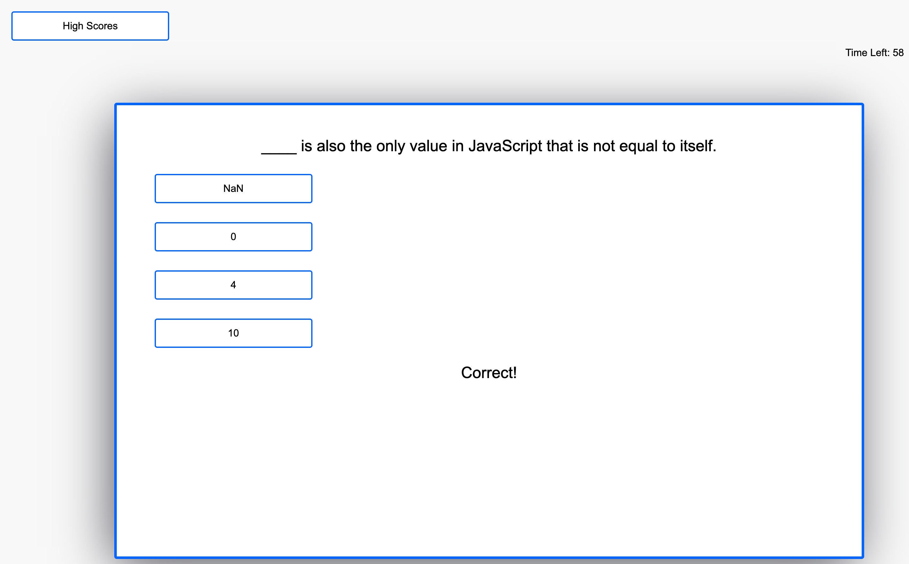
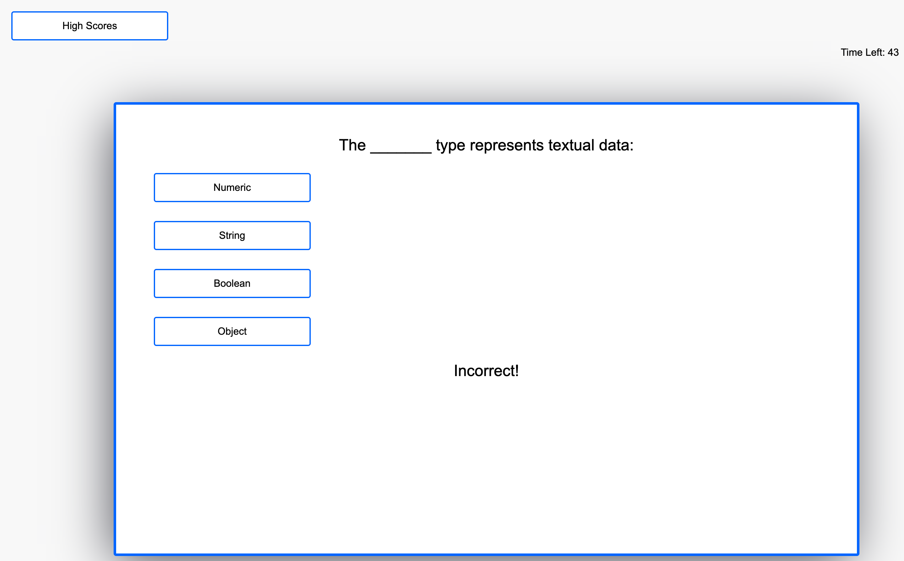
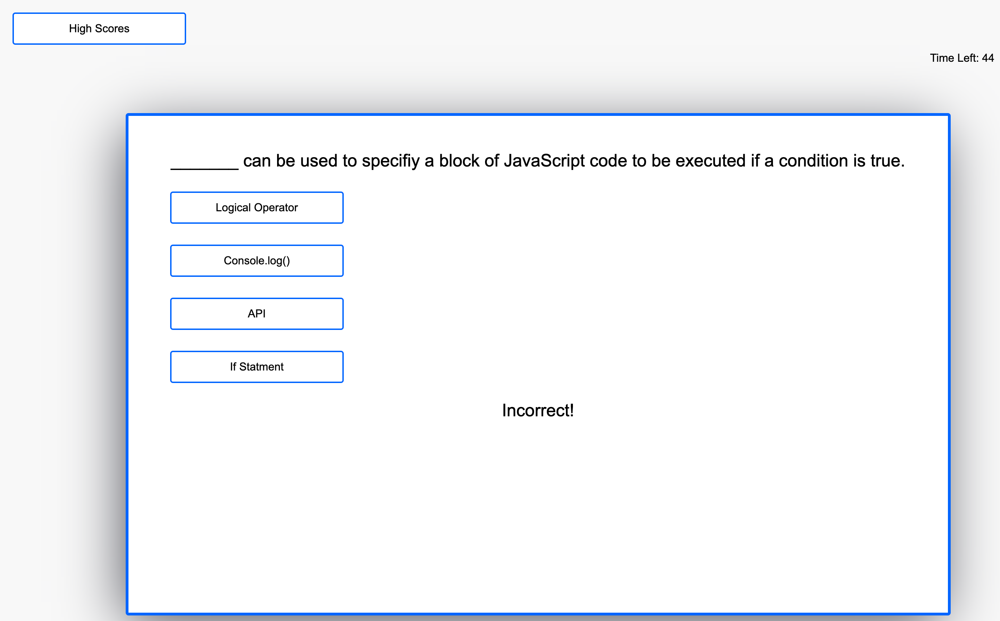
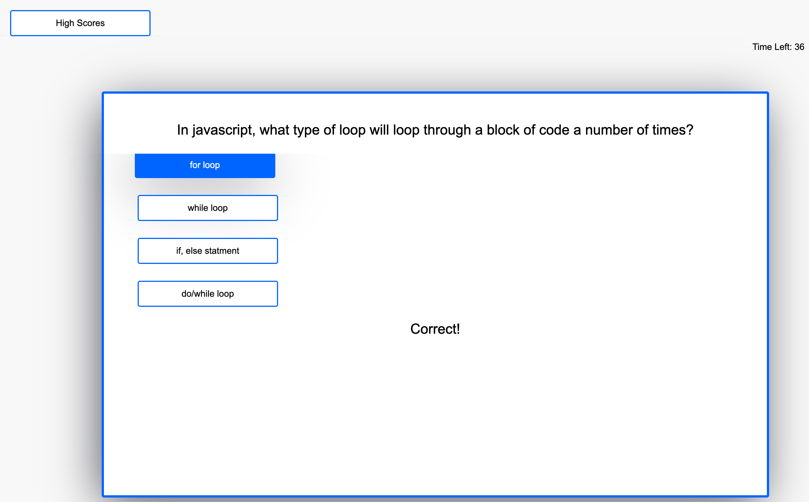

# Coding Quiz Module Challenge

## Purpose 

The purpose of this project was to build a timed Coding Quiz Application on a webpage that stores High Scores.  Building this project will allow me to utilize HTML, CSS and JavaScript skills learned so far.  In addition it will allow me to build upon the API skills and techniques learned in the module to build a dynamic and responsive webpage. 

## HTML

* Added Div Tags with ID and Class names to set layout for webpage. These containers also contain the 

* Static buttons and text added within appropriate Div tag for items.

* 'onclick' call added to static buttons within HTML to reference JavaScript function.  

## CSS 

* Added root element for background colors for page, containers and buttons.

* Added button stylings and hover effects for buttons to make webpage more interactive and user friendly.

* Styling added to each container and buttons within that container.

* Text was styles according to each container for the quiz to make it more friendly to the user.

* Pop displays added in CSS to show user High Scores, also adjusted text size within the pop display and aligned it to the center of the display.  

## Javascript

* Global variables set to reference for functions, including userscore and timeleft for the beginning.

* Added Array with Quiz questions and answers within the array as objects.  

* Added function to begin quiz once 'Start Quiz' button is clicked. 

* beginQuiz() function also sets time counter for quiz and sets parameter for what happens when time runs out.

* Function created for to proceed to next question after a question is answered.  Function will also end quiz once all questions have been answered.

* Function added for answer choice button to grab choices from the quiz array and display for the appropriate questions.

* Function added to calculate user score when a question is correct and to deduct time from the countdown when a question is answered incorrectly. Function will also display a status message indicating whether or not the previous question was correct or incorrect.

* Function quizOver added to display the final user score.

* Function saveUserScore added to allow user to save intials and score to localStorage on the browser.  Using JSON to stringify the items for storage.   

* Compare function added to organize the high scores from highest to lowest scores. 

* exitQuiz function added to return user to instruction/start quiz screen.

* getHighScore function added to grab the high score information from the localStorage and display those items on the pop up display when the 'View High Scores' button is clicked. 

## GitHub Link

[GitHub](https://github.com/j-faust/api-module-challenge)

## Website URL

[Coding Quiz App]()

## Webpage Screenshots

